# Network architecture icons

###### Flat LAN blue

[README](./visio/flat-lan-blue/README.md) | [SVG](./svg/flat-lan-blue/) | [PNG](./png/flat-lan-blue/)

<table width='90%'>
<tr align='center'>
    <td align='center'></td>
    <td align='center'></td>
    <td align='center'></td>
    <td align='center'></td>
    <td align='center'></td>
    <td align='center'>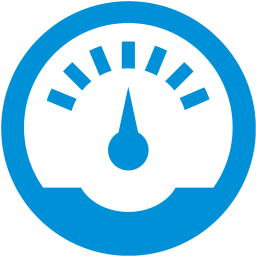</td>
    <td align='center'></td>
    <td align='center'></td>
    <td align='center'></td>
    <td align='center'></td>
</tr>
<tr align='center'>
    <td align='center'></td>
    <td align='center'></td>
    <td align='center'></td>
    <td align='center'></td>
    <td align='center'></td>
    <td align='center'></td>
    <td align='center'></td>
    <td align='center'></td>
    <td align='center'></td>
    <td align='center'></td>
</tr>
<tr align='center'>
    <td align='center'></td>
    <td align='center'>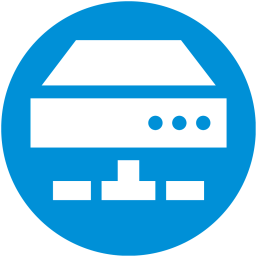</td>
    <td align='center'>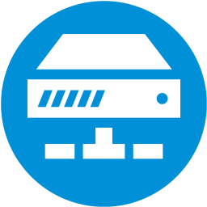</td>
    <td align='center'></td>
    <td align='center'></td>
    <td align='center'>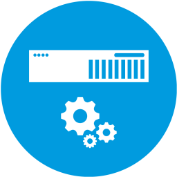</td>
    <td align='center'>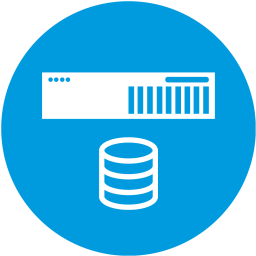</td>
    <td align='center'></td>
    <td align='center'>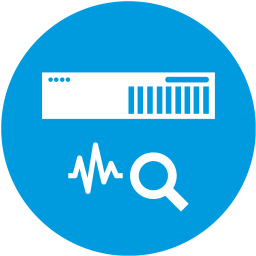</td>
    <td align='center'>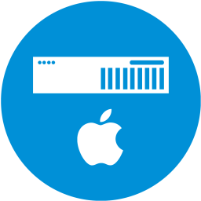</td>
</tr>
<tr align='center'>
    <td align='center'>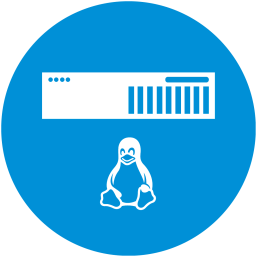</td>
    <td align='center'>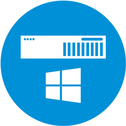</td>
    <td align='center'>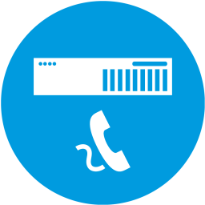</td>
    <td align='center'>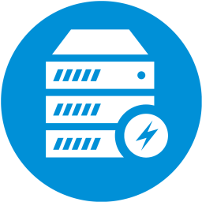</td>
    <td align='center'>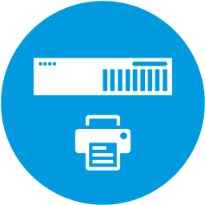</td>
    <td align='center'>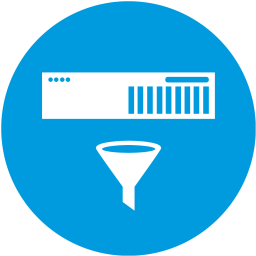</td>
    <td align='center'>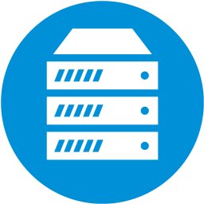</td>
    <td align='center'>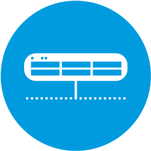</td>
    <td align='center'>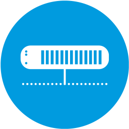</td>
    <td align='center'>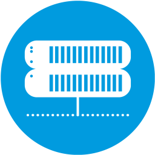</td>
</tr>
<tr align='center'>
    <td align='center'>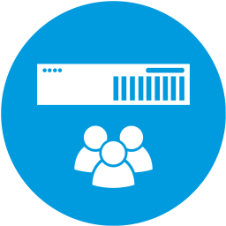</td>
    <td align='center'>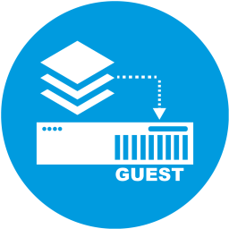</td>
    <td align='center'>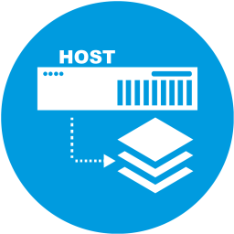</td>
    <td align='center'></td>
    <td align='center'>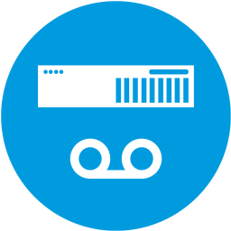</td>
    <td align='center'>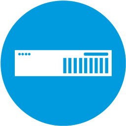</td>
    <td align='center'></td>
    <td align='center'></td>
    <td align='center'>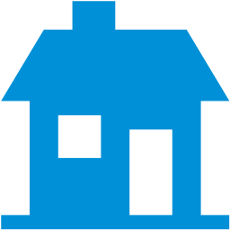</td>
    <td align='center'>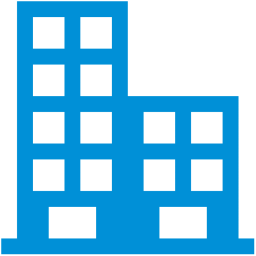</td>
</tr>
<tr align='center'>
    <td align='center'>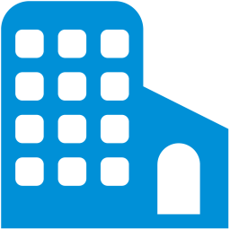</td>
    <td align='center'></td>
    <td align='center'></td>
    <td align='center'>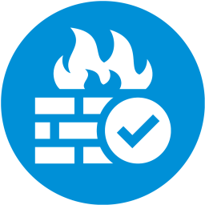</td>
    <td align='center'>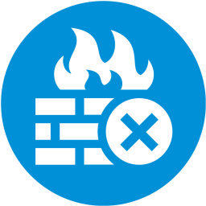</td>
    <td align='center'>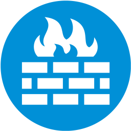</td>
    <td align='center'>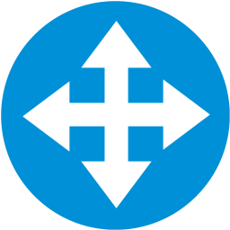</td>
    <td align='center'>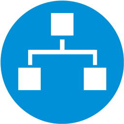</td>
    <td align='center'>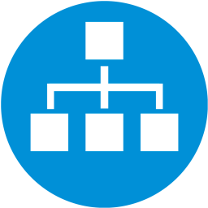</td>
    <td align='center'>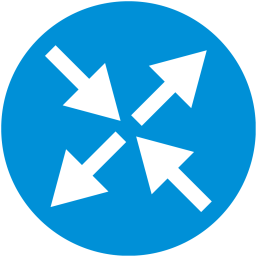</td>
</tr>
<tr align='center'>
    <td align='center'></td>
    <td align='center'>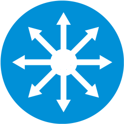</td>
    <td align='center'></td>
    <td align='center'></td>
    <td align='center'>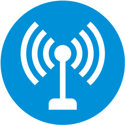</td>
    <td align='center'></td>
    <td align='center'>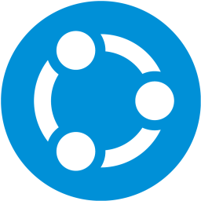</td>
    <td align='center'>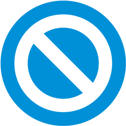</td>
    <td align='center'></td>
    <td align='center'></td>
</tr>
<tr align='center'>
    <td align='center'></td>
    <td align='center'></td>
    <td align='center'></td>
    <td align='center'></td>
    <td align='center'></td>
    <td align='center'></td>
    <td align='center'></td>
    <td align='center'></td>
    <td align='center'></td>
    <td align='center'>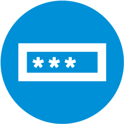</td>
</tr>
<tr align='center'>
    <td align='center'></td>
    <td align='center'></td>
    <td align='center'></td>
    <td align='center'></td>
    <td align='center'>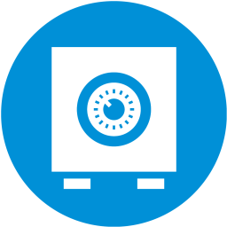</td>
    <td align='center'></td>
    <td align='center'></td>
    <td align='center'></td>
    <td align='center'></td>
    <td align='center'>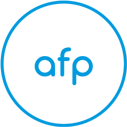</td>
</tr>
<tr align='center'>
    <td align='center'></td>
    <td align='center'></td>
    <td align='center'></td>
    <td align='center'></td>
    <td align='center'></td>
    <td align='center'>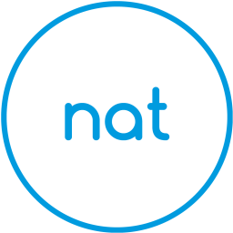</td>
    <td align='center'></td>
    <td align='center'></td>
    <td align='center'></td>
    <td align='center'></td>
</tr>
<tr align='center'>
    <td align='center'></td>
    <td align='center'></td>
    <td align='center'></td>
    <td align='center'></td>
    <td align='center'></td>
    <td align='center'></td>
    <td align='center'></td>
    <td align='center'></td>
    <td align='center'></td>
</tr>
</table>

###### Building | Access

[README](./svg/building/access/README.md) | [SVG](./svg/building/access/) | [PNG](./png/building/access/)

<table width='90%'>
<tr align='center'>
    <td align='center'></td>
    <td align='center'></td>
    <td align='center'></td>
    <td align='center'></td>
    <td align='center'></td>
    <td align='center'></td>
</tr>
</table>

###### Building | Fire prevention

[README](./svg/building/fire-prevention/README.md) | [SVG](./svg/building/fire-prevention/) | [PNG](./png/flat-building/fire-prevention/)

<table width='90%'>
<tr align='center'>
    <td align='center'></td>
    <td align='center'></td>
    <td align='center'></td>
    <td align='center'></td>
</tr>
</table>

###### Building | Lift

[README](./svg/building/lift/README.md) | [SVG](./svg/building/lift/) | [PNG](./png/flat-building/lift/)

<table width='90%'>
<tr align='center'>
    <td align='center'></td>
    <td align='center'></td>
    <td align='center'></td>
    <td align='center'></td>
    <td align='center'></td>
</tr>
</table>

###### Building | Parking

[README](./svg/building/parking/README.md) | [SVG](./svg/building/parking/) | [PNG](./png/flat-building/parking/)

<table width='90%'>
<tr align='center'>
    <td align='center'></td>
    <td align='center'></td>
    <td align='center'></td>
    <td align='center'></td>
    <td align='center'></td>
</tr>
</table>